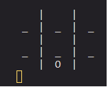

<pre>
                  .___________. __    ______    .___________.    ___       ______    .___________.  ______    _______ 
                  |           ||  |  /      |   |           |   /   \     /      |   |           | /  __  \  |   ____|
                  `---|  |----`|  | |  ,----'   `---|  |----`  /  ^  \   |  ,----'   `---|  |----`|  |  |  | |  |__   
                      |  |     |  | |  |            |  |      /  /_\  \  |  |            |  |     |  |  |  | |   __|  
                      |  |     |  | |  `----.       |  |     /  _____  \ |  `----.       |  |     |  `--'  | |  |____ 
                      |__|     |__|  \______|       |__|    /__/     \__\ \______|       |__|      \______/  |_______|
                                                                                                                      
                                                                                    </pre>

# A TIC TAC TOE console game written in c

to run it build with make. Then run exe .\tic_tac_toe.exe.

controllers are the 1,2,3,4,5,6,7,8,9 keys.

